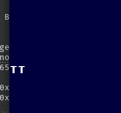
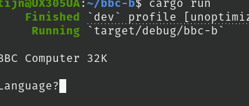
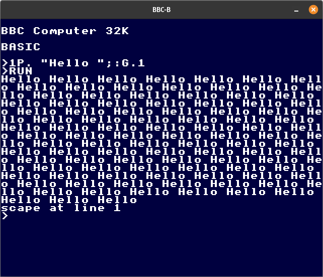

# BBC-B
Pet project to learn about 6502 CPU, Rust and BBC micro computer

* ALU does binary `ADC`/`SBC`, shifts and rotates, bit wise Boolean, ...
* Addressing modes tested in original prototype
* Stack, register transfers, load & store
* Branch, jump and subroutines
* `BRK` and IRQ and NMI handling
* 6502 disassembler
* Preliminary benchmark performance ~7e7 instructions / second
* Memory page dispatcher routes `0xFE00-FF` to SHEILA mapped I/O (under
  construction)
* Snoop `OSWRCH` and pipe output to terminal — allows us to see what's going on
  despite lack of video circuit emulation
* Quick 'n' dirty `MODE 4` frame buffer, using
  [minifb](https://docs.rs/crate/minifb/latest) to see what's going on (do
  proper video ULA and 6845 later)
* (Barely) `RUN`s a manually typed program in BBC BASIC 2!
## todo
* Instruction execution puts PC increment in wrong place
* No timing or cycle counting whatsoever
* Missing 99% peripherals
* Has only 11% of mos6522 logic for system VIA and rudiments of keyboard
  interface
* Write protect ROM area, paged ROM/RAM bank switching, JIM, FRED, ...
* OMG, [Toby Nelson](https://tobylobster.github.io/mos/mos/index.html)'s
  annotated MOS assembly is a treasure!
* Added somewhat and refactored *B-em* C implementation of 6522 (system) VIA
  [wrapped in Rust](crates/b-em-sysvia/README.md)
* Intent is not to keep it there permanently but to compare behaviour to my own
  implementation and hopefully manage to emulate a *working* keyboard that way

---
Hmmm. So far so good. Booting the OS 1.20 ROM and looking for signs of live in
(alleged) video area (`0x3000` - `0x7FFF`) yields only zeroes, except for a
mysterious 16 bytes:

```
00004880  7e 18 18 18 18 18 18 00  7e 18 18 18 18 18 18 00  |~.......~.......|
```

Emulating Mode 0, 3, or 4 monochrome graphics, this looks like `TT`:



---
Progress: after clearing the SHEILA page (all zeroes; RAM rather than mapped
devices), I'm seeing:

```
% hd dump.bin 
00000000  00 00 00 00 00 00 00 00  00 00 00 00 00 00 00 00  |................|
*
00007c00  20 20 20 20 20 20 20 20  20 20 20 20 20 20 20 20  |                |
*
00007c20  20 20 20 20 20 20 20 20  42 42 43 20 43 6f 6d 70  |        BBC Comp|
00007c30  75 74 65 72 20 33 32 4b  20 20 20 20 20 20 20 20  |uter 32K        |
00007c40  20 20 20 20 20 20 20 20  20 20 20 20 20 20 20 20  |                |
*
00007c70  20 20 20 20 20 20 20 20  f9 4c 61 6e 67 75 61 67  |        .Languag|
00007c80  65 3f 20 20 20 20 20 20  20 20 20 20 20 20 20 20  |e?              |
00007c90  20 20 20 20 20 20 20 20  20 20 20 20 20 20 20 20  |                |
*
00008000
```

So it looks like we've landed in MODE 7, where the initialization loop detected
correct amount of memory, tried to set up devices and interrupt vectors but
fails to find the BASIC rom at 0x8000-0xC000. Which is fair, because it's not
loaded, yet.

---
Added interception of calls to `OSWRCH`, forwarding `A` register (character to
write) to standard out. No working keyboard yet, but this should simplify
interactive debugging and regression tests.



...And after adding stuffing the Basic ROM at `0x8000`, the `Language?` error disappears as well:

```

BBC Computer 32K

BASIC

█
```
BASIC writes the prompt character `>` by-passing the `OSWRCH` vector, so I'm
intercepting `0xE0A4`, rather than `0xFFEE` to make that work:
```

BBC Computer 32K

BASIC

>█
```
Still no keyboard, though :-(

If finally managed to force my key presses into the machine, by passing all of
the system VIA, hardware emulation. For now, I'm pushing input into the MOS
keyboard buffer (`03E0..03FF`). This works if I manage to pop the `F10` key
that the OS pushes initially during reset (not sure why that's never picked up).



