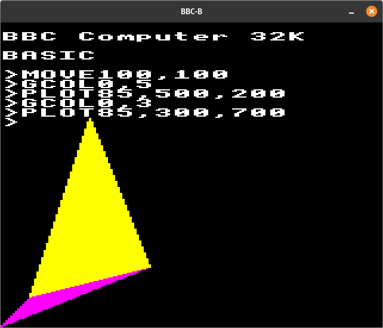

# BBC-B
Pet project to learn about 6502 CPU, Rust and BBC micro computer

* ALU does binary `ADC`/`SBC`, shifts and rotates, bit wise Boolean, ...
* Addressing modes tested in original prototype
* Stack, register transfers, load & store
* Branch, jump and subroutines
* `BRK` and IRQ and NMI handling
* 6502 disassembler
* Preliminary benchmark performance ~7e7 instructions / second
* Memory page dispatcher routes `0xFE00-FF` to SHEILA mapped I/O (under
  construction)
* Snoop `OSWRCH` and pipe output to terminal — allows us to see what's going on
  despite lack of video circuit emulation
* Quick 'n' dirty `MODE 4` frame buffer, using
  [minifb](https://docs.rs/crate/minifb/latest) to see what's going on (do
  proper video ULA and 6845 later)
* (Barely) `RUN`s a manually typed program in BBC BASIC 2!
## notes
* (See also: [diary](log.md))
* Instruction execution puts PC increment in wrong place
* No timing or cycle counting whatsoever
* Missing 99% peripherals
* Has only 11% of mos6522 logic for system VIA and rudiments of keyboard
  interface
* Write protect ROM area, paged ROM/RAM bank switching, JIM, FRED, ...
* OMG, [Toby Nelson](https://tobylobster.github.io/mos/mos/index.html)'s
  annotated MOS assembly is a treasure!
* Added somewhat and refactored *B-em* C implementation of 6522 (system) VIA
  [wrapped in Rust](crates/b-em-sysvia/README.md)
* Intent is not to keep it there permanently but to compare behaviour to my own
  implementation and hopefully manage to emulate a *working* keyboard that way

