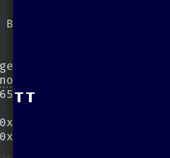
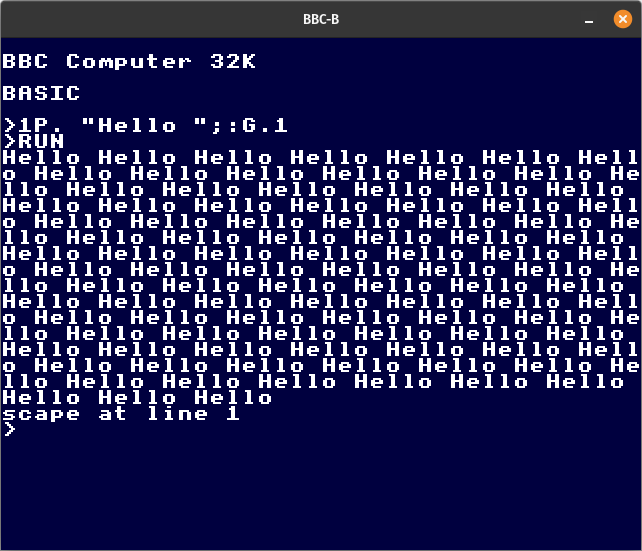

2024-11-06 — first commit. Had been doing some 6502 prototyping, implementing
different addressing modes and opcode flavours and considered it serious enough
to put under source control.

---
2024-11-10 —
Hmmm. So far so good. Booting the OS 1.20 ROM and looking for signs of live in
(alleged) video area (`0x3000` - `0x7FFF`) yields only zeroes, except for a
mysterious 16 bytes:

```
00004880  7e 18 18 18 18 18 18 00  7e 18 18 18 18 18 18 00  |~.......~.......|
```

Emulating Mode 0, 3, or 4 monochrome graphics, this looks like `TT`:



---
2024-11-14 —
Progress: after clearing the SHEILA page (all zeroes; RAM rather than mapped
devices), I'm seeing:

```
% hd dump.bin 
00000000  00 00 00 00 00 00 00 00  00 00 00 00 00 00 00 00  |................|
*
00007c00  20 20 20 20 20 20 20 20  20 20 20 20 20 20 20 20  |                |
*
00007c20  20 20 20 20 20 20 20 20  42 42 43 20 43 6f 6d 70  |        BBC Comp|
00007c30  75 74 65 72 20 33 32 4b  20 20 20 20 20 20 20 20  |uter 32K        |
00007c40  20 20 20 20 20 20 20 20  20 20 20 20 20 20 20 20  |                |
*
00007c70  20 20 20 20 20 20 20 20  f9 4c 61 6e 67 75 61 67  |        .Languag|
00007c80  65 3f 20 20 20 20 20 20  20 20 20 20 20 20 20 20  |e?              |
00007c90  20 20 20 20 20 20 20 20  20 20 20 20 20 20 20 20  |                |
*
00008000
```

So it looks like we've landed in MODE 7, where the initialization loop detected
correct amount of memory, tried to set up devices and interrupt vectors but
fails to find the BASIC rom at 0x8000-0xC000. Which is fair, because it's not
loaded, yet.

---
2024-11-21 —
Added interception of calls to `OSWRCH`, forwarding `A` register (character to
write) to standard out. No working keyboard yet, but this should simplify
interactive debugging and regression tests.


...And after adding stuffing the Basic ROM at `0x8000`, the `Language?` error disappears as well:

```

BBC Computer 32K

BASIC

█
```

---
2024-12-11 —
BASIC writes the prompt character `>` by-passing the `OSWRCH` vector, so I'm
intercepting `0xE0A4`, rather than `0xFFEE` to make that work:
```

BBC Computer 32K

BASIC

>█
```
Still no keyboard, though :-(

---
2024-12-12 —
I finally managed to force my key presses into the machine, by passing all of
the system VIA, hardware emulation. For now, I'm pushing input into the MOS
keyboard buffer (`03E0..03FF`). This works if I manage to pop the `F10` key
that the OS pushes initially during reset (not sure why that's never picked up).



---
2024-12-17 —
I might have an idea about why the keyboard often seems to crash the emulator.
But for now, I seem to have MODE 2 with 8 colours:


---
2024-12-19 —
Indeed: a subtle but fatal flaw in my implementation of 6502 `CMP` instruction
was the cause of MOS keyboard routine's misbehaviour. Turns out I was dutifully
updating the `V` (overflow flag) bit in `P` register resulting from subtraction.
This is wrong as the *BBC Micro Advanced User Guide* documents that this bit is
unaffected by a *compare*.

`V` functions as a Boolean parameter to MOS' `REMV` to indicate that the buffer's
current character must only be *examined* (rather than popped). So: nothing wrong
with the system VIA; just some sloppy coding of the CPU.
---
2024-12-27 —
Removed hacky keyboard emulation because it (mostly) works using the *minifb*
keypress events. Continued validation of 6522 timer modes.
